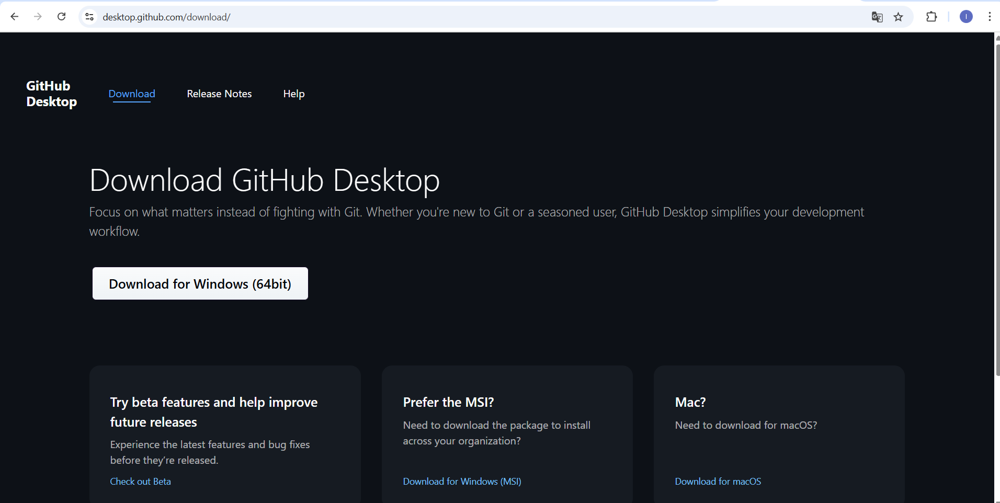
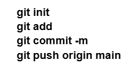
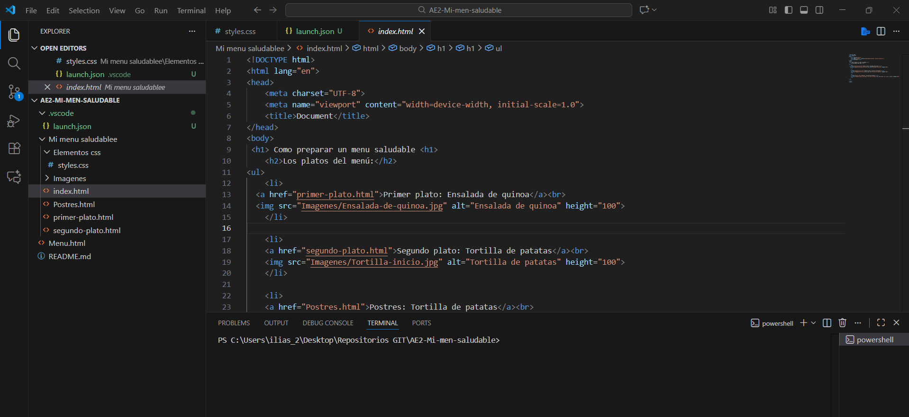
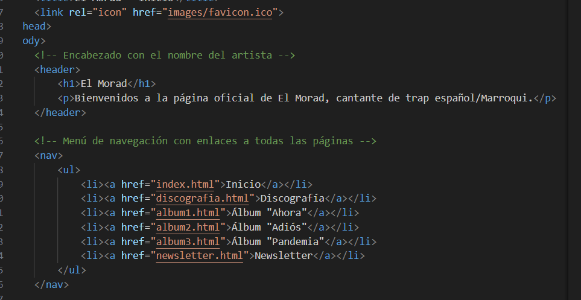

# ASIX_0373_AE01_Apuntes
Apuntes del curso. Primera parte.

Apuntes de Lenguajes de Marcas y Sistemas de Gestión de Información

Este repositorio contiene todos los apuntes que voy haciendo durante la asignatura, incluyendo la teoría y las actividades prácticas que realizamos en clase. Aquí voy registrando todo lo aprendido sobre GitHub, Markdown y HTML.

Índice de contenidos

1.GitHub

2.Markdown

3.HTML

GitHub

En clase aprendimos qué es GitHub y para qué sirve. Básicamente, GitHub sirve para guardar nuestros proyectos y poder ver todos los cambios que hacemos. También nos permite trabajar en grupo sin liarnos y mantener un historial de los cambios que realizamos.

Primero instalé Git desde su página oficial. Después configuré mi nombre y mi correo para que quede registrado quién hace los cambios en el repositorio. Aprendí que la rama principal de los proyectos puede llamarse main o master, dependiendo de la versión de Git, y que se puede cambiar si quieres.

Luego creé un repositorio nuevo en GitHub. Elegí si quería que fuera público o privado y si quería añadir un archivo README desde el principio. También aprendí la diferencia entre un repositorio vacío y uno inicializado, y cómo esto cambia la forma de trabajar en local.

Para trabajar en mi ordenador con un repositorio que ya estaba en GitHub, lo cloné, entré en la carpeta y fui haciendo los cambios. Cada vez que añadía cosas, las guardaba con un commit y luego subía todo al repositorio de GitHub para que se actualizara. También aprendimos a crear repositorios desde cero en local y luego vincularlos con un repositorio de GitHub. Aprendí a importar proyectos que ya existían de otras personas y, al final, a publicar todo en GitHub Pages para que se pudiera ver online. Con esto entendí cómo organizar los archivos, trabajar en local y remoto, y publicar proyectos para que cualquiera pueda verlos.

Markdown

En clase aprendimos qué es Markdown y para qué sirve. Markdown es un lenguaje de marcas que nos permite dar formato a los textos de manera sencilla sin usar programas complicados. Podemos crear títulos, listas, enlaces, imágenes y resaltar texto fácilmente.

Encabezados

Los encabezados se hacen con # y sirven para los títulos:

# → título grande

## → título un poco más pequeño

### → título todavía más pequeño

Estilos de letra

Cursiva: *texto*

Negrita: **texto**

Tachado: ~~texto~~

Listas

Listas ordenadas

Se hacen con números y no hace falta que sean consecutivos. Por ejemplo:

1.Primer elemento

2.Segundo elemento

Sublistas:
1. Elemento principal
    1. Subelemento

Listas desordenadas

Se usan -, * o +. Por ejemplo:

Primer elemento

Segundo elemento

- Elemento principal
    * Subelemento

Párrafos

Para crear un párrafo nuevo basta con dejar una línea en blanco entre textos.

Bloques de código

Se pueden poner entre acentos graves simples si es una línea:
Todo esto es `código`.

Para varias líneas se usan tres acentos graves al inicio y al final:
<html>
  <head>
  </head>
</html>

Tablas
Se hacen con | y separando los encabezados con al menos tres guiones ---. Los dos puntos sirven para alinear las columnas.

Comandos de Git básicos en Markdown

git init  iniciar un repositorio

git add  añadir archivos

git commit -m  guardar los cambios

git push origin main  subir los cambios al repositorio de GitHub

HTML

Teoría de HTML
HTML (HyperText Markup Language) es el lenguaje que se usa para crear páginas web. Es el más importante de Internet porque sin HTML no se vería nada en el navegador. HTML define la estructura y el contenido de la web, como párrafos, títulos, listas, imágenes y enlaces. No sirve para dar estilo, que es lo que hace CSS, ni para hacer que la web interactúe, que se hace con JavaScript o PHP.

Los elementos HTML son los bloques de construcción de la web. Cada elemento tiene una etiqueta de apertura, contenido y etiqueta de cierre. Por ejemplo:

Mi gato es muy gruñón

Atributos
Los elementos pueden tener atributos, que añaden información extra sin alterar el contenido. Por ejemplo:

Mi gato es muy gruñón

Algunos elementos son vacíos, como  y no necesitan contenido. También se pueden anidar elementos dentro de otros.

Estructura básica de un fichero HTML
Una página HTML típica incluye:

Declaración <!DOCTYPE html>

Elemento <html> que contiene todo

Dentro de <html>, un <head> y un <body>

El <head> contiene metadatos, enlaces a hojas de estilo, scripts y otras cosas que no se ven directamente.
El <body> contiene todo lo visible de la página, como párrafos, listas, tablas, encabezados, imágenes y enlaces.
EJEMPLO:
<!DOCTYPE html>
<html>
  <head>
    <meta charset="utf-8">
    <title>Mi página de prueba</title>
    <link rel="icon" href="favicon.png">
  </head>
  <body>
    
  </body>
</html>

Dentro del <body> hay elementos de bloque, que ocupan toda la línea y pueden contener otros elementos, y elementos en línea, que ocupan solo el espacio necesario y se usan dentro de otros elementos.

Actividad 1: Mi menú saludable
Hicimos una actividad llamada Mi menú saludable, donde el objetivo era crear una web mostrando cómo preparar un menú saludable con un primer plato, un segundo y un postre. La idea era poner en práctica todo lo aprendido y trabajar siguiendo la metodología de GitHub: primero en local y luego subir los cambios al repositorio remoto.

La web constaba de cuatro páginas: la principal y una página para cada plato. En la principal puse el título "Com preparar un menú saludable" y enlaces a las otras tres páginas, con imágenes de cada plato. Cada página de receta tenía favicon, un enlace para volver a la principal con un icono de flecha, un encabezado con el título del plato, un índice de contenidos con enlaces a ingredientes, pasos y resultado final, y cada sección estaba separada por líneas horizontales. En la sección de pasos, las cantidades se ponían en negrita y los ingredientes en texto normal, además de añadir imágenes para cada paso. Al final se incluía una imagen del resultado final y un enlace de vuelta al encabezado principal. Organicé las carpetas y los nombres de archivos de forma ordenada, validé todos los documentos HTML con el validador del W3C, publiqué la web en GitHub Pages y añadí la URL en la descripción del repositorio.

Actividad 2: My Spoty

Para poner en práctica todo lo que aprendimos, hicimos una actividad llamada MiSpoty. La intención de la actividad era crear una página web que simulara un pequeño reproductor de
música, parecido a Spotify, usando solo HTML.

La idea era que la página tuviera:
Un encabezado principal con el nombre “MiSpoty” y un menú de navegación que enlazara con diferentes secciones de la página, como “Canciones”, “Artistas” y “Álbumes”.

Una sección de canciones: aquí listábamos canciones en un listado ordenado, con el nombre de la canción y el artista. Cada canción tenía un pequeño icono al lado usando  para la portada o un play button.

Una sección de artistas: una lista desordenada con los nombres de los artistas y una pequeña imagen de cada uno.

Una sección de álbumes: un índice con enlaces que llevaba a cada álbum en la página

Además, tuvimos que poner imágenes representativas para cada álbum y artista, usando  con alt para describirlas y poder mejorar la accesibilidad.

También añadimos listas ordenadas y desordenadas para organizar canciones y artistas, y títulos y subtítulos con <h1>, <h2> y <h3> para que la estructura fuera clara.

En la sección de artistas, usamos listas desordenadas y añadimos imágenes pequeñas:

20/11/2025
CSS Evolución y función
En los primeros años de la web, HTML era muy limitado. Solo permitía organizar el contenido y añadir texto, pero no tenía herramientas para controlar el aspecto visual de una página. Con el tiempo, los sitios web se volvieron más complejos y atractivos, y HTML se empezó a llenar de etiquetas nuevas pensadas únicamente para cambiar la apariencia. Esto no era lo ideal, porque mezclaba la estructura del contenido con su diseño.
Para solucionar ese problema surgió CSS, un lenguaje creado para encargarse exclusivamente del estilo de las páginas. Mientras HTML define qué es cada elemento (por ejemplo, un título, un párrafo o un enlace), CSS le dice al navegador cómo debe verse: colores, tamaños, espaciados, posición en la pantalla, etc. Gracias a esto, HTML puede centrarse en la estructura y CSS en la parte estética, evitando confusiones y permitiendo un trabajo más limpio.
El origen de CSS se remonta a mediados de los años 90, cuando el W3C recibió varias propuestas para crear un sistema de hojas de estilo. De esas opciones salieron las bases de lo que después se convertiría en CSS1, el primer estándar oficial, publicado hacia finales de 1996. A ese estándar le siguió CSS2 en 1998, que fue una versión más completa y avanzada. Años después, en 2008, se revisó y se actualizó como CSS2.1 para corregir y mejorar varios aspectos.
Actualmente, el desarrollo se centra en CSS3. A diferencia de las versiones anteriores, CSS3 está dividido en módulos independientes, lo que permite actualizar y aprobar cada parte por separado. Algunos de esos módulos ya son estándar y otros continúan evolucionando. Esta forma de trabajar hace que CSS pueda adaptarse mejor a la velocidad con la que cambian las necesidades del diseño web.
CSS Ventajas e inconvenientes
Las ventajas de usar hojas de estilo son:
Posibilidad de mantener el código más fácilmente.

A nivel de diseño, CSS es más potente que las etiquetas de diseño de (X)HTML.

CSS es un lenguaje sencillo.

Se pueden definir diferentes hojas de estilo para un solo documento (X)HTML, por ejemplo, un estilo para la página web cuando se visita desde un ordenador y otra para cuando queramos imprimirla.

Se pueden reutilizar desde diferentes documentos (X)HTML.

El gran inconveniente es que no todos los navegadores se comportan de la misma forma ante una hoja de estilo, dado que algunos no cumplen con los estándares establecidos. Así, obligan al programador a crear diferentes hojas de estilo.
CSS Ubicación
Las hojas de estilo en CSS pueden colocarse en distintos lugares dentro de un documento HTML, y según dónde se escriban, tienen un funcionamiento y un uso más adecuado en unas situaciones u otras. Básicamente, hay tres formas de aplicar CSS: inline, interno y externo.
Estilo inline
 Este método consiste en escribir las propiedades CSS directamente dentro de la etiqueta HTML usando el atributo style. Por ejemplo, podemos centrar un texto o cambiar su color sin necesidad de ningún archivo adicional.
 Es una forma rápida y útil para cambios muy puntuales, pero no es recomendable para proyectos grandes porque mezcla la estructura con la presentación, hace el código difícil de mantener y obliga a repetir muchas veces el mismo estilo.

Estilo interno
 En este caso, el CSS se coloca dentro del propio documento HTML, concretamente dentro de la etiqueta <style> situada en la cabecera <head>.
 Esta opción sirve cuando la página tiene pocos estilos o cuando queremos que el diseño afecte solo a esa página concreta. Aun así, sigue sin ser ideal para proyectos grandes, ya que no permite reutilizar los estilos fácilmente.

Estilo externo
 Es la forma más profesional y organizada de trabajar. Consiste en escribir todos los estilos en un archivo externo con extensión .css y enlazarlo desde el HTML mediante un <link> dentro del <head>.
 Esto hace que el HTML quede limpio, que los estilos se puedan reutilizar en muchas páginas y que sea mucho más sencillo mantener o modificar el diseño. Además, permite que el navegador cargue la hoja de estilo una sola vez, lo que mejora el rendimiento del sitio.

En resumen, aunque las tres maneras son válidas, el uso de un archivo CSS externo es el más recomendado para cualquier trabajo serio, ya que separa completamente el contenido de la presentación y facilita la organización del proyecto. Los estilos inline y los internos pueden servir para casos puntuales o páginas pequeñas, pero no escalan bien cuando el proyecto crece.

CSS Prioridad
1. Prioridad según dónde está escrito el CSS
El CSS puede ir en tres lugares:
En un archivo externo .css.

Dentro de la etiqueta <style> en el <head> del HTML.

Dentro de la propia etiqueta HTML usando style="".

El orden de prioridad es este:
Inline tiene más prioridad que interno, y el interno tiene más prioridad que el externo.
En otras palabras:
 si un elemento tiene un estilo dentro del atributo style="", ese estilo gana a lo que diga el CSS interno o el externo.
2. Cuanto más específico sea el selector, más manda
Aquí la idea es sencilla. Si yo escribo un estilo muy general, como h1, es fácil que otro estilo más concreto lo supere.
Por ejemplo:
h1 es muy general.

.box h1 es más concreto.

#main h1 es todavía más concreto.

Lo concreto gana. Así de simple.
3. El uso de !important
Si un estilo lleva !important, ese estilo pasa por encima de los demás, incluso aunque otro tenga más prioridad por ser más específico.
Solo se ve superado por otro !important que sea más concreto.
4. Herencia
Algunas propiedades, como el color del texto o el tipo de letra, se heredan del elemento padre. Pero si hay algún estilo directo aplicado al elemento, ese es el que manda, no lo heredado.
5. Cuando dos reglas tienen la misma fuerza
Si dos estilos tienen la misma prioridad y afectan al mismo elemento, gana el que esté más abajo en el archivo CSS. CSS se lee de arriba hacia abajo.

CSS Sintaxis
CSS funciona a base de reglas, y cada regla sirve para darle estilo a uno o varios elementos de una página web.
Una regla está formada por dos partes:
El selector → dice a qué elemento quieres aplicar los estilos.

Las declaraciones → son las órdenes que le das a ese elemento, por ejemplo el color del texto, el tamaño, el fondo…

Cada declaración tiene:
una propiedad (por ejemplo: font-size)

un valor (por ejemplo: 20px)

p es el selector (afecta a todos los párrafos),

font-size y background-color son propiedades,

10pt y gray son los valores.

CSS Comentarios

En CSS solo existe el comentario en bloque, que se pone así:

Todo lo que haya entre /* y */ el navegador lo ignora.
Sirve para apuntarte cosas y no olvidarte.

Ejemplo: Cambiar estilos de párrafos

Ejemplo 2: Estilos diferentes para título y texto

27/11/2025
CSS: Sintaxis básica CSS (Tipos de selectores)
Hay diferentes selectores, cada uno de los cuales corresponde con una parte diferente del etiquetado.
 Los más básicos son:
Selector de elementos (selector de tipo)

Selector de id

Selector de clase

Selectores avanzados:
Selector universal

Selectores de atributos

Selectores de hijos

Selectores de descendientes

Selectores de hermanos adyacentes

Pseudoclases

Pseudoelementos

CSS: Sintaxis básica CSS (Tipos de selectores básicos 3/3)
Selector de clase
Corresponde con todos los elementos que tengan el atributo class con el valor especificado. Por ejemplo el selector:
.example {
}
property: value:
property2: value2;
afectaria a todos los elementos HTML que tienen el atributo class con el valor especificado, por lo
que
el
selector anterior afectaria a
los
siguientes

<li class="example"> 

elementos
HTML:

CSS: Sintaxis básica CSS (Tipos de selectores)
Hay diferentes selectores, cada uno de los cuales corresponde con una parte diferente del etiquetado. Los más básicos son:
1. Selector de elementos (selector de tipo)
2. Selector de id
3. Selector de clase
Selectores avanzados:
1. Selector universal
2. Selectores de atributos
3. Selectores de hijos
4. Selectores de descendientes
5. Selectores de hermanos adyacentes.
6. Pseudoclases
7. Pseudoelementos

